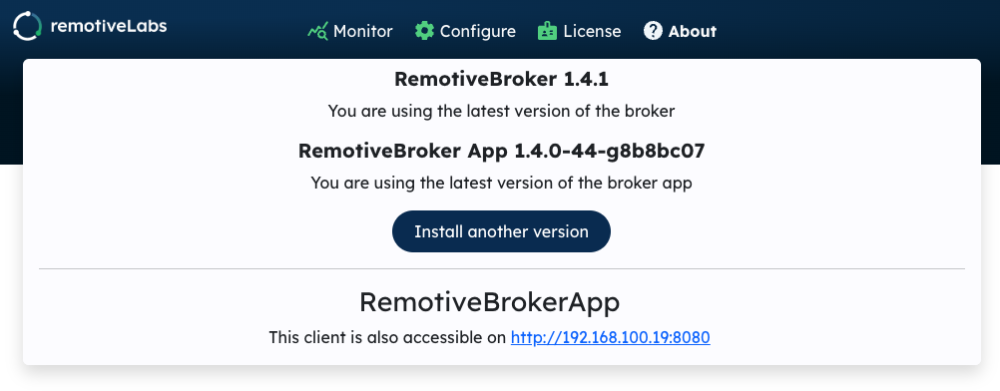
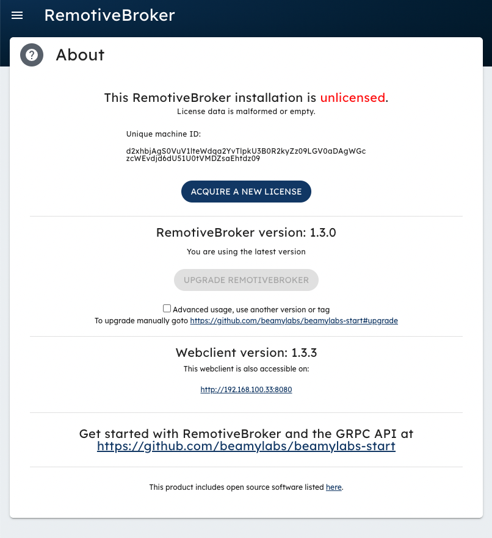
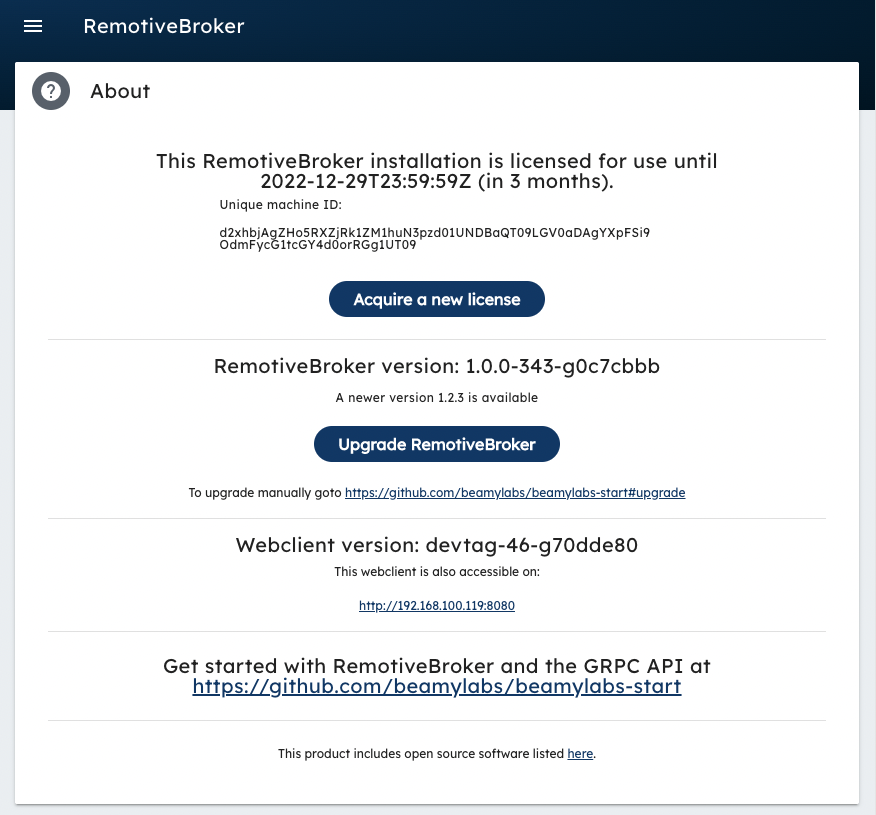
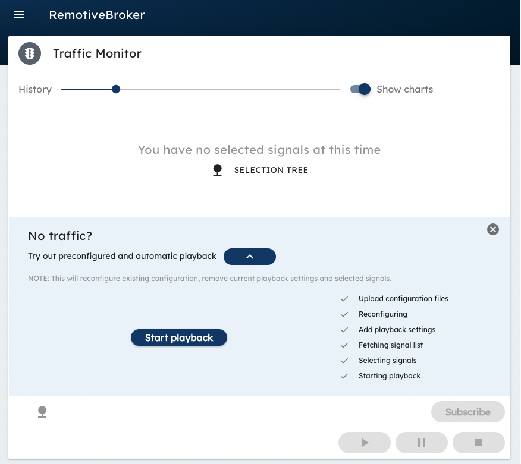
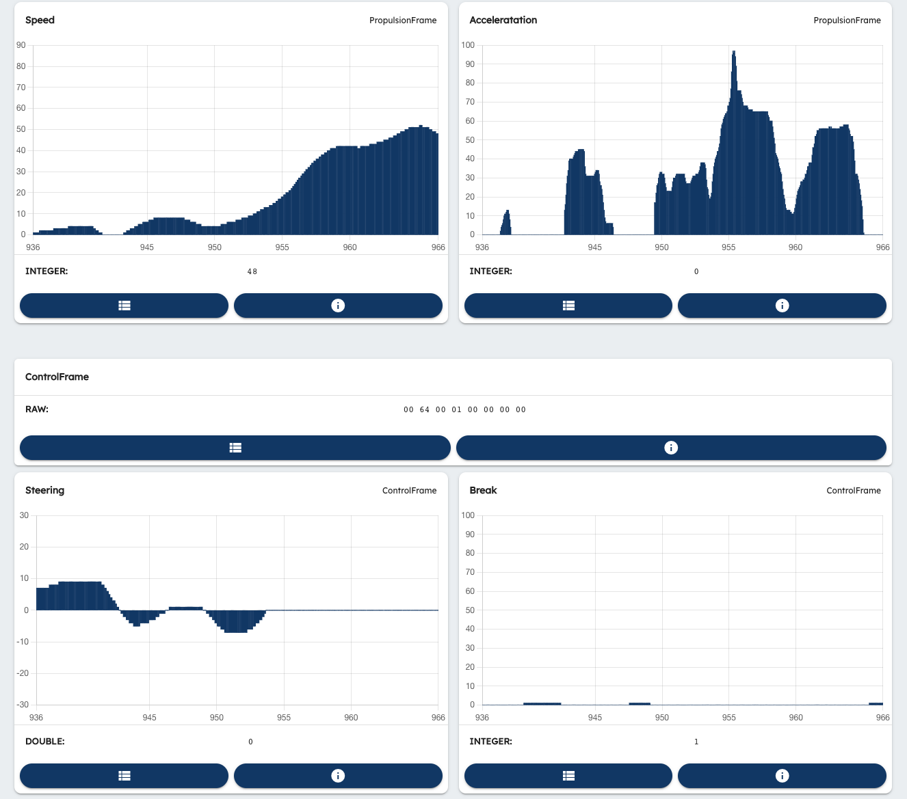
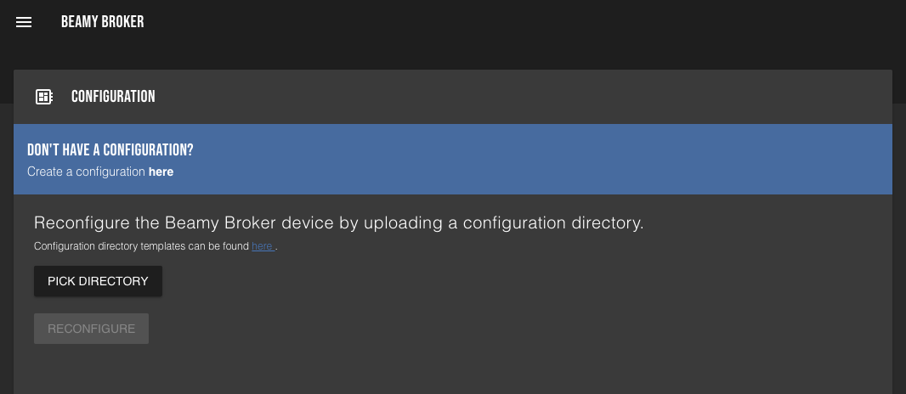
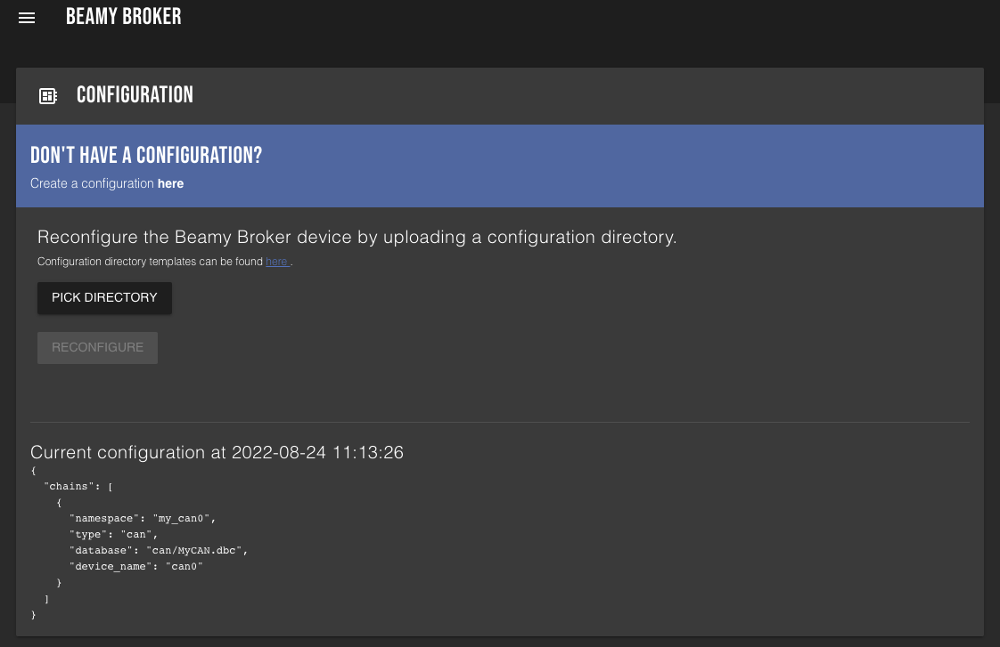
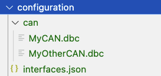

# User Guide

RemotiveLabs is a lightweight and language agnostic platform for software-centric automotive development. We offer a free evaluation 
licence for 30 days. RemotiveBroker can be installed on the hardware of your choice (we have a growing list of 
[reference kits](https://www.remotivelabs.com/downloads-documentations/)).  

!> **Just curious and only need a first taste?**<br>
   We offer a cloud demo with recorded signal data. Get a first sense of the platform without logging in: 
   [Go to demo in cloud](https://demo.remotivelabs.com/). If you have questions regarding the platform, licence cost or if you have 
   ideas on features you’d like to see? Join our GitHub community or feel free to [Contact us!](https://www.remotivelabs.com/contact)


## Get your licence

Please follow the steps below which include installing RemotiveBroker on the hardware of your choice before you can request a licence. 
Email [support@remotivelabs.com](mailto:support@remotivelabs.com?subject=Hello!) in case of questions.

### 1. Choose your hardware

RemotiveBroker can be installed on the hardware of your choice. Please find our growing list of reference kits under our 
[Downloads & Documentations](https://remotivelabs.com/downloads-documentations/) page on our website. 

#### a. Reference kit: Raspberry Pi 

For convienince purposes we provide prebuilt [Raspberry Pi 4 images](https://releases.remotivelabs.com/) with the 
[Seeed CAN-shield](https://www.seeedstudio.com/2-Channel-CAN-BUS-FD-Shield-for-Raspberry-Pi-p-4072.html) drivers. 
If you don't have a can shield you can use any socketcan compatible usb device, keep reading.


> **Prerequisites**<br>
  Raspberry Pi + CAN-BUS HAT for Raspberry Pi<br>
  SD card in an SD card reader connected to your computer<br>
  `Raspberry Pi Imager`, which can be downloaded from [here](https://www.raspberrypi.com/software/)

1. Download the latest image from https://releases.remotivelabs.com/. At the time of writing this is *rpi-20220908_154525.img.gz*. 
2. In `Raspberry Pi Imager`, choose "Use custom" and then select the downloaded image and write the image to the SD card.
3. Put the SD card in the Pi
4. Connect the Pi to ethernet so it gets internet access, where it will download additional upgrades when available (highly recommended)

!> ssh access is by default only available over wired ethernet. Username/pwd pi/Aut0m0tive

5. Boot the Pi, this might take a few minutes the first time
6. Next it's time to connect to the Pi with a web-browser, but first we need to resolve the IP to the RemotiveBroker.

   **Connected to internet through router (wired)**

   If possible, the easiest way is the get the IP/URL from your router using it's admin interface.

   If this is not possible, you need to connect to the RemotiveBroker internal WiFi access point.
   From your phone or computer, connect using WiFi **remotivelabs-\*** (password: remotivelabs) and navigate to http://192.168.4.1:8080. 
   In "About" section your can find the URL where the broker is accessible on your regular WiFi.

   

   Change back to your regular WiFi and use http://ip_in_your_router:8080 instead. You now have internet
   access from both your client and the RemotiveBroker which will make things easier as we move on.
 
   **Not connected to internet router**

   If you are not connected to internet, you need to connect to the RemotiveBroker internal WiFi access point.
   From your phone or computer, connect using WiFi **remotivelabs-\*** (password: remotivelabs) and navigate to http://192.168.4.1:8080. 
   In this state there is no internet access on your desktop or your browser which means that things get
   a bit more complicated as we move on.


7. In web-client navigate to "About" it should now look something like this.

   

You are now ready to [Request a License](#request-a-hardware-license).

#### b. Reference kit: Linux with Docker

> **Prerequisites**<br>
  You will need git, docker, docker-compose installed on your linux distribution<br>

1. Get going with `docker-compose` in a few moments by using our [bootstrap repository](https://github.com/remotivelabs/remotivebroker-bootstrap)

2. Next step is to request a [License](#request-a-license)

### 2. Request a Hardware License

Running RemotiveBroker requires a valid hardware license. We offer a 30 day free evaluation license. After installing RemotiveBroker you can request a license through the web-client (or through the license API).


!> If you are not connected to internet, pay extra attention to the steps in the guide since you 
   will need to switch back and forth between networks on your desktop.


1. Press "ACQUIRE NEW LICENSE" 

   !> Your email MUST be part of an organisation with a licence policy, otherwise a 30 day trial
      version is created for you.

2. Enter your email to request a license.

3. Wait for the returning e-mail and copy/paste the licence phrase and press "ADD LICENSE".

4. Under "About" it should now look something like this and you are now good to start use your RemotiveBroker.

     

5. To verify that your installation is successful you can navigate to "Traffic Monitor" and replay 
   a test drive that comes bundled. Expand the "Try out preconfigured and automatic playback" and press
   "Start playback".

    

   This will upload a RemotiveBroker configuration together with a recorded drive, then start the recording and subscribe to some of the signals.

   If everything is ok, you should see some graphs beeing displayed with "live" data.

   

   You now have a operational licenced RemotiveBroker.

### 3. What to do next

Below some tips for how to start getting value from RemotiveBroker and RemotiveExplorer. We recommend (in the order of your choice):

* If you haven’t already, join our GitHub Community for Q&A and discussions
* Check out out [code samples](#code-samples)
* Check out [RemotiveCloud](https://demo.remotivelabs.com/)
* Share your client code [here](https://github.com/remotivelabs/remotivelabs-samples), just make a PR and we'll have a look.

# Code samples

When your RemotiveBroker is up and running you are ready to connect and run your own code.

We offer a few code examples at our [Github samples repository](https://github.com/remotivelabs/remotivelabs-samples).

As a developer you may choose to use our maintained libraries or work directly towards our 
[public gRCP api](https://github.com/remotivelabs/remotivelabs-apis/tree/main/protos), as mentioned before, share your code; just make a PR and we'll have a look.

#### Python

The [Python](https://www.python.org/) samples are found in the [python directory](https://github.com/remotivelabs/remotivelabs-samples/python) in our samples repository. All the Python samples use our Python library which is available in the Python Package manager [PyPi](https://pypi.org/user/remotivelabs/).

Install the Python library with `pip` in a terminal:

    pip install -U remotivelabs-broker

After the installation in complete you may execute any of the samples in the Python directory.

Remember all our samples requires a RemotiveBroker which is up and running. Each sample is provided with a _readme_ file explaining how to run the sample with the necessary arguments.

> You can host your RemotiveBroker locally alternatively you can deploy you RemotiveBroker in [RemotiveCloud](https://demo.remotivelabs.com/). 
   
#### Andorid VHAL integration

For more information, go [here](https://github.com/remotivelabs/remotivelabs-samples/tree/main/integrations/android-vhal).

# Your first configuration (in car)

Using this configuration you will be able to subscribe or record live signals in a real vehicle (or any operational can bus).

!> This example requires that you have equipment which can be connected connected to the vehicle. Possible setup is 
   [a](#a-reference-kit-raspberry-pi) or [b](#b-reference-kit-linux-with-docker) with a socketcan adapter.<br> 
   You also need the proper matching dbc file which corresponds to the bus you are connecting to.

Once the RemotiveBroker is operational with a license you can use the web-client to generate a configuration that the RemotiveBroker can
use.

There are two ways to configure the RemotiveBroker, one is to use the UI wizard and the other way is to upload a configuration directory containing the required files. Here we will use the wizard.

1. In the menu in web-client choose "Configuration" and you should see something like this.

      

2. Under "Don´t have a configuration?" , press "Create configuration __here__" to start the wizard.
   
   Pick your dbc file and then you can just click through all steps without any changes. The last step "Reconfigure" will upload the configuration to the broker

3. Your RemotiveBroker is now ready to subscribe to signals in your car.

!> If it's quiet on the bus you can try and enable/disable the terminator on your can adapter (shield or connected using USB).

## About configuration

You can always query the current configuration in the menu. In web-client choose "Configuration" and you should see a valid configuration.



The following is a typical and very simple configuration
```json
{
  "chains": [
    {
      "namespace": "my_can0",
      "type": "can",
      "database": "can/MyCAN.dbc",
      "device_name": "can0"
    },
    {
      "namespace": "my_can1",
      "type": "can",
      "database": "can/MyOtherCAN.dbc",
      "device_name": "can1"
    }
  ]
}
```
* `namespace` is your given name, which you can choose freely. This is the name you will use when you browse the bus in the `tree view` of write some code to access it. Suggestions would be: `BodyCAN`, `VehicleCan`  
* `type` suggest what kind of physical link we are connecting to. This could be `can, canfd, vcan, lin, flexray, udp`
* `database` hold information on how to encode and decode the traffic on link. Typlically a file with extenision `ldf, dbc, xml`
* `device_name` is the physical socket representaion on your host computer. These names are controlled by your linux kernel and can be listed by doing `ip a`. On our prebuilt images valid names are `[can0..can1], [vcan0..vcan3]` 

The example above contains two namespaces for the sake of clarity. Your configuration can hold any number of namespace depeding on your hardware setup.

### Upload your custom configuration

You can upload your custom configuration, in the web-client choose "Configuration" and select "Pick directory". For the example above the directory which should be selected should contain the following



Once uploaded the RemotiveBroker will verify that the configuration is valid, if not please verify that your `interfaces.json` and the relative database paths are correct.

!> Advanced reference for `interfaces.json` is located [here](https://github.com/remotivelabs/remotivebroker-bootstrap/blob/master/configuration/interfaces_referense.json).

## Additonal interfaces

As the configuration above suggested additional interfaces can be added to the existing setup. Some of these setups requires `ssh` and custom configuration of the host, in this scenario, the Raspberry Pi 4.

> Typical usb to ethernet adapter [here](images/USB-to-Ethernet.png) 

> In this case `host` referrs to Raspberry Pi 4

### LIN interfaces

Connect a secondary usb to ETH adapter to the host. Here you can connect a single `LIN transivers` box alternatively a switch with a number of `LIN transivers` each lin transiver is identified and configured according to it's unique `device_identifier`

This id needs to reflect and be present in `interfaces.json`. The following configuration shows two `lin` devices, `8` and `7`. Note that `8` has been configured to operate as master whereas `7` operates as slave.

Each LIN transiver need a unique set of `target_port` and `server port` which can be selected freely. Once the trancivers get powered their configurations will be distributed.

```json
{
  "chains": [
    {
      "namespace": "ecu_A",
      "type": "lin",
      "config": {
        "device_identifier": 8,
        "server_port": 2014,
        "target_port": 2013
      },
      "node_mode": "master",
      "database": "ldf/test.ldf",
      "schedule_file": "ldf/test.ldf",
      "schedule_table_name": "DEVMLIN01Schedule01",
      "schedule_autostart": true
    },
    {
      "namespace": "ecu_B",
      "type": "lin",
      "config": {
        "device_identifier": 7,
        "server_port": 2015,
        "target_port": 2016
      },
      "node_mode": "slave",
      "database": "ldf/test.ldf"
    }
  ]
}
```

!> The prebuilt image will host a DHCP server on the added adapter. LIN transivers and the RemotiveBroker needs to reside on the same subnet. Other custom topologies are supported and sometimes preferred.

### CAN interfaces (additonal)

Any socketcan compatible USB dongle can be added when physical interfaces are required. Amongst others, [PEAK-System](https://www.peak-system.com/) does provide such devices. 
### Flexray interfaces

!> Write is currently not supported out of the box and requires customizations.
#### Technica CM CAN COMBO

!> Make sure that your Techinca devices is configured to use `PLP` headers and also make sure to note specified `Destination MAC` (available by clicking `SPY`) typically `01:00:5e:00:00:00`. 

Connect your Technica device to the secondary usb ethernet interface `eth1` which is mentioned above. As mulitcast address provide `Destination MAC`.
```json
{
  "chains": [
      {
         "type": "flexray",
         "device_name": "flexray0",
         "namespace": "MyFlexrayNamespace",
         "config": {
            "target_host": "127.0.0.1",
            "target_port": 51111,
            "hardware": "Technica_CM_CAN_COMBO",
            "target_config": {
               "interface": "eth1",
               "multicast": "01:00:5e:00:00:00"
            }
         },
         "database": "fibex_files/flexray.xml"
      }
   ]
}
```

#### Host Mobility MX-4 T30 FR

Host Mobility MX-4 T30 FR can be used as a host for RemotiveBroker alternatively it can be
configured to forward flexray traffic.

Check out [bootstrap repository](https://github.com/remotivelabs/remotivebroker-bootstrap) for more information on how to get going.

